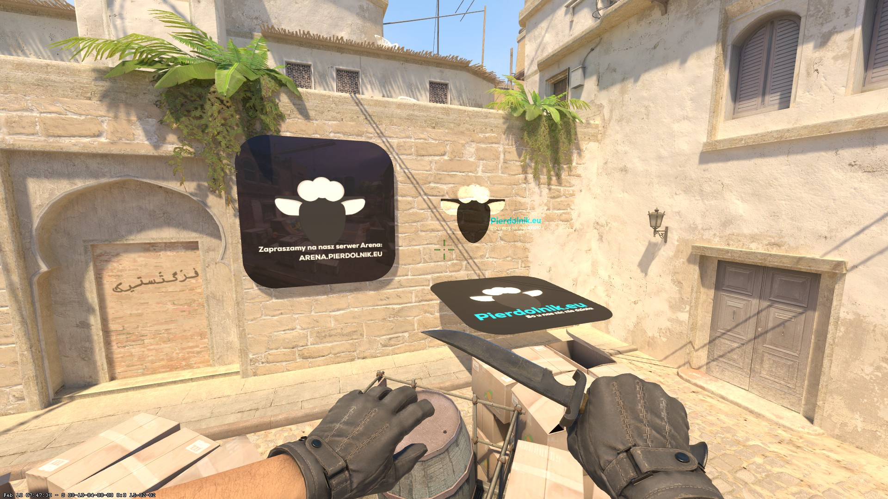

> [!CAUTION]
> With the 28.07.2025 update, decal plugin might crash clients / server. Seems that .vmat files are not cached properly. Until it is fixed I recommend using [CS2-Poor-MapPropAds](https://github.com/Letaryat/CS2-Poor-MapPropAds) that uses props instead of decals.  

# CS2-Poor-MapDecals

This plugin allows for server owners to create spray type advertisements that are placed on wall.<br/>
[](https://ko-fi.com/H2H8TK0L9)

## [📺] Video presentation
SoonTM
<p align="center">
    
</p>

## [📌] Setup
- Download latest release,
- Download [CS2MenuManager by schwarper](https://github.com/schwarper/CS2MenuManager) - For menu API.
- Drag files to /plugins/
- Restart your server,
- Config file should be created in configs/plugins/
- Edit to your liking,

## [📝] Configuration
| Option  | Description |
| ------------- | ------------- |
| Admin Flag (string) | Which flag will have access to all of the commands  |
| Vip Flag (string) | Which flag would not see advertisements that are not forced on vip users |
| Props Path (string[]) | Paths for all advertisements that your addon have |
| Custom Position Values (int[]) | Custom values that will change position of the advert |
| Custom Angle Values (int[]) | Custom values that will change rotation of the advert |
| Enable commands (bool) | If you want commands to be enabled. (for example, after you placed all of the advertisements you might not need commands anymore) |
| Debug Mode (bool) | If plugin should log errors, etc |

### [📝] Config example:
```
{
  "Admin Flag": "@css/root",
  "Vip Flag": "@vip/noadv",
  "Props Path": [
    "models/advert1.vmdl",
    "materials/decal_1.vmat",
    "materials/advert_3.vmat",
    "materials/advert_1.vmat"
  ],
  "Custom Position Values": [1,5,10],
  "Custom Angle Values": [1,5,10],
  "Enable commands": true,
  "Debug Mode": true,
  "ConfigVersion": 1
}
```

## [🛡️] Admin commands
Tried to make plugin idiot proof (since I did a lot of mistakes).
| Command  | Description |
| ------------- | ------------- |
| css_mapadverts | Menu that allows to setup advertisements |


## [❤️] Special thanks to:
- [CS2-SkyboxChanger by samyycX](https://github.com/samyycX/CS2-SkyboxChanger) - For function to find id of cached material.
- [Edgegamers JailBreak](https://github.com/edgegamers/Jailbreak/blob/main/mod/Jailbreak.Warden/Paint/WardenPaintBehavior.cs#L131) - For function to check if player is looking at his pretty feet.
- [CS2MenuManager](https://github.com/schwarper/CS2MenuManager) - For menu API.
- [f3nixCoding](https://github.com/f3nixCodings) - For updated function with keyvalues for decals.

### [🚨] Plugin might be poorly written and have some issues. I have no idea what I am doing, but when tested it worked fine.